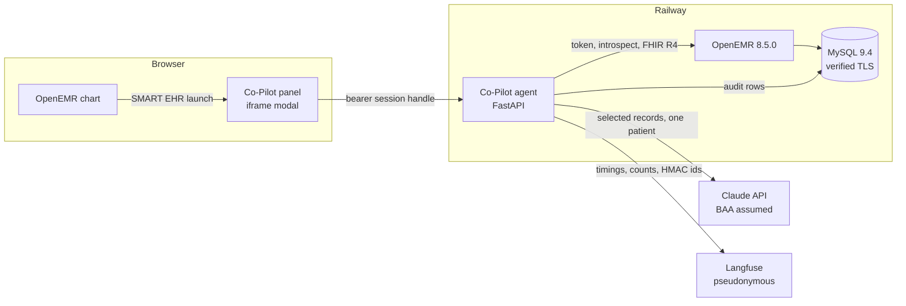

# ARCHITECTURE.md — Clinical Co-Pilot

Traces to [USERS.md](USERS.md) (UC1–UC6) and [AUDIT.md](AUDIT.md) (finding IDs). Revised after an adversarial review of the first draft (four independent reviewers: assignment compliance, OpenEMR feasibility, security/HIPAA, verification and latency).

## Summary

The Co-Pilot is a **SMART on FHIR app** a primary care physician opens from the OpenEMR patient chart. It is a separate Python service (FastAPI) that reads patient data **only** through OpenEMR's FHIR R4 API with the physician's own OAuth token, and uses Claude Haiku 4.5 to decide *what matters*, never to *state facts*.

**Claude selects; the server speaks.** Claude receives normalized, cited records and returns a structured plan: which records matter, in what order, which lab trends to show, and whether the question is out of scope. **Every sentence the physician reads is rendered by server code from the cited record**, with its date. Absence ("No allergies recorded as of 10:42"), coverage, counts and safety flags are server-generated too. This removes what a citation check can't catch: negated claims, invented doses, misquoted values (review blocker). For a 90-second glance, cited facts beat fluent prose.

**Verification is deterministic.** Every record id Claude selects must belong to the session's patient and to this session's fetched data, or it is dropped and counted. A rules engine checks allergy ↔ drug-class conflicts (including drugs named only in the question), bleeding and hyperkalemia risk, duplicate statins, critical lab values and metformin with low eGFR, from an explicit versioned table. Flags always render. If nothing valid survives, the physician gets a non-AI fallback: the normalized lists, the flags and the reason.

**Authorization.** OpenEMR's `user/` scopes enforce role permissions but don't bind a patient; `patient/` scopes bind a patient but skip role checks (SEC-1, ARCH-3, COMP-M1). We use `user/` scopes and bind the patient **on the server** from the launch context confirmed by OpenEMR token introspection. No browser or model input can change it. The session handle lives only in page memory and travels as a bearer header, so there are no third-party cookies and no CSRF.

**Latency.** OpenEMR, not the LLM, is the bottleneck (PERF-1, PERF-2, PERF-4). At launch the agent prefetches a fixed, date-bounded set of records in parallel through a concurrency limit, and shows allergies, flags and data status before any LLM call. Each question has a 9-second deadline: one Claude call, at most one tool round, no hidden SDK retries. Target: first verified answer ≤ 5 s p50, ≤ 10 s p95.

**Data quality.** Real OpenEMR output duplicates every medication, emits template placeholders as lab values and mislabels units; the normalizer fixes or flags each defect before Claude sees data, with a test per defect.

**Observability and audit without PHI.** Every request gets a server-generated correlation id carried through logs, FHIR calls, the Claude call and Langfuse. Langfuse receives timings, statuses, counts, tokens, cost and verification outcomes, with patient and user as HMAC pseudonyms and no clinical text (COMP-3). A separate insert-only audit table records who asked, about which patient, what was read and the outcome (COMP-7).

**Main tradeoffs.** Server-rendered answers trade fluency for verifiability. Prefetch trades seconds of staleness for speed (answers show "data as of"). `user/` scopes make the agent responsible for patient binding. OpenEMR has no care-team ACL and FHIR ignores encounter sensitivity (SEC-M1), so any user with `patients/med` can use the Co-Pilot on any patient their role can open.

---

## 1. Components and trust boundaries



| Boundary | What crosses | Enforced by |
|---|---|---|
| Browser → agent | Questions; opaque session handle | 256-bit handle held in JS memory only, sent as `Authorization: Bearer`; server stores `sha256(handle)`; idle TTL 15 min, never beyond token expiry; ≤ 3 live sessions per user; CSP `default-src 'self'; frame-ancestors <OpenEMR origin>`; all text rendered with `textContent` |
| Agent → OpenEMR | FHIR reads with the physician's token | OpenEMR role ACL; agent patient lock on every call; global concurrency semaphore |
| Agent → Claude | One patient's normalized records: allergies, meds, problems, recent labs and vitals, encounter dates and types, **age and sex** (no name, DOB, MRN, contact data or encounter free text) | Context builder; chart text fenced as data; BAA assumed per brief |
| Agent → Langfuse | Durations, statuses, counts, tokens, cost, outcome enums, HMAC(patient), HMAC(user) | Manual spans with explicit fields; exceptions reduced to type + HTTP status before recording (a 3.7.0 `@observe` captures exception text regardless of capture flags) |
| Chart text → model | Allergy names, problem titles, drug names | Treated as data; the model can't emit prose, URLs or tool calls that choose a patient; any tool argument outside the session's allowlist is denied and audited (SEC-M2) |
| Agent → audit table | Event rows | INSERT-only MySQL user over `REQUIRE SSL` |
| OpenEMR → MySQL | All PHI at rest | TLS 1.3, CA-verified cert for `mysql.railway.internal`, `REQUIRE SSL` (OPS-2) |

## 2. Launch, sessions and authorization

### Configuration OpenEMR needs

`rest_fhir_api=1`; `site_addr_oath=<public https origin>` so `iss`, `aud` and token URLs are stable behind Railway's TLS proxy; `api_log_option=1` (SEC-3). The image's `OPENEMR_SETTING_*` sync fails silently under required TLS (OPS-7), so these are set over a verified TLS SQL session. The agent has two settings: `PUBLIC_ISSUER` (checked against `iss`) and `FHIR_BASE` (used for calls; the private network address).

### Client registration

A confidential client (required for `user/` scopes), registered via `POST /oauth2/default/registration` with launch URI `https://<agent>/smart/launch` and redirect URI `https://<agent>/smart/callback`. An admin enables it and sets `skip_ehr_launch_authorization_flow` so a launch from the chart needs no second login (ARCH-5). Secret only in the agent's environment.

### EHR launch (UC1–UC4, UC6)

```mermaid
sequenceDiagram
  participant P as Physician
  participant E as OpenEMR
  participant A as Agent
  P->>E: Launch "Clinical Co-Pilot" (patient card)
  E->>A: GET /smart/launch?launch&iss&aud
  A->>A: iss == PUBLIC_ISSUER; launch not seen before
  A->>E: 302 authorize(response_type, client_id, redirect_uri, scope, state, aud=iss, launch, S256 challenge)
  E->>A: GET /smart/callback?code&state
  A->>E: POST token (secret, code, verifier)
  A->>E: POST introspect (client credentials)
  A->>A: validate, create session, start prefetch
  A->>P: Panel HTML with handle in a JS variable
  P->>A: GET /api/session (bearer) -> banner, data status, flags
```

**Callback validation (reject the session on any failure):** introspection `active=true`; granted scope ⊆ the allowlist (`openid fhirUser launch user/Patient.rs user/AllergyIntolerance.rs user/MedicationRequest.rs user/Condition.rs user/Observation.rs user/Encounter.rs user/Appointment.rs`), no `patient/` or write scope; no `refresh_token`; `patient` present; `fhirUser` is `Practitioner/` or `Person/`, never `Patient/`. The `launch` value is refused if reused within an hour. The callback response is `no-store` and `no-referrer`, the page strips `code` and `state` with `history.replaceState`, and access logs never include query strings.

**Patient identity on screen:** OpenEMR launches with whatever patient is in the PHP session, and says `need_patient_banner=false`. We ignore that: name, DOB and MRN from `Patient/{id}` show at the top of the panel and on every answer, so a mismatch with the chart is visible (review finding).

**Re-launch:** closing the modal destroys the iframe and its handle. A new launch creates a new session and reuses prefetched data for the same (user, patient) if younger than 120 s.

### Schedule scan launch (UC5)

Stock OpenEMR has no menu SMART launch (only the patient card), so UC5 is a **standalone launch in a top-level window** at `https://<agent>/schedule`. OpenEMR shows its login and scope consent once per session, which is acceptable at 8:40 AM. No `launch` scope; the session is bound to the user only. Patient reads are allowed only for patients returned by today's appointment list for that user.

### API sessions (evals, API collection)

`POST /api/sessions {access_token, patient_id?}`. The agent introspects the token with its client credentials and applies the same scope and `fhirUser` checks. The patient comes from the token's launch context when present (standalone launch with `launch/patient` shows OpenEMR's patient picker). Otherwise `patient_id` is accepted only if it's in `EVAL_PATIENT_IDS` (synthetic patients). Logged as `source=api`. Enabled on the demo deployment for graders; disabled for real PHI (`ALLOW_API_SESSIONS=false`).

**Grader token path (API collection):** Bruno's OAuth2 authorization-code flow with the demo physician's credentials from the collection's environment file, requesting `launch/patient` plus the scope allowlist. OpenEMR's password grant stays off on the deployment.

## 3. Data access

### Prefetch

Through one `asyncio.Semaphore` in front of OpenEMR (default 6, set below the PHP worker count; waiters exported as queue depth). Per call: connect timeout 1 s, read timeout 3 s; one retry, **only on connection errors**, only if ≥ 3 s remain. Each resource type ends with a load status.

| Resource | Query | Why |
|---|---|---|
| Patient | `Patient/{id}` | Banner (name, DOB, MRN) and model context (age, sex only) |
| AllergyIntolerance | `?patient=` | Full list |
| MedicationRequest | `?patient=` | Full list; normalized (DQ-3, DQ-M3) |
| Condition | `?patient=` | No category filter: `problem-list-item` silently drops encounter-linked problems (ARCH-M2) |
| Observation labs | `?patient=&category=laboratory&date=ge{today−18mo}` | No server paging (PERF-4); one real patient has 905 labs |
| Observation vitals | `?patient=&category=vital-signs&date=ge{today−12mo}` | |
| Encounter | `?patient=&date=ge{today−24mo}` | Dates and types only reach the model; free-text reason does not (SEC-M1) |

| Load status | Meaning | Server-rendered text |
|---|---|---|
| `pending` | Still fetching | Question waits for it until the deadline, then answers with it listed as unavailable |
| `ok` / `empty` | Records / none | Facts, or "No allergies recorded in OpenEMR (as of 10:42)" |
| `forbidden` (403) | Role can't view | "Medications: not permitted for your account" |
| `expired` (401) | Token ended | "Session expired: relaunch from the chart" |
| `error` / `timeout` | Failure after retry policy | "Labs unavailable right now (timeout)" |

**Freshness:** every answer shows "Data as of HH:MM". Before a question, any resource older than 120 s is refetched within the deadline (allergies and medications first).

### Normalization (implemented: `agent/normalize.py`, tests in `agent/tests/test_normalize.py`)

Each rule handles a defect observed in real OpenEMR output (AUDIT observed-data notes):

- **Medications:** order rows and their duplicate plan rows (drug name only, RxNorm code misfiled in `reasonCode` under the SNOMED system) fold into one record with both source ids; disagreeing statuses become `status_conflict`; `authoredOn` is presented as *recorded on*, never *started*, and OpenEMR FHIR has no stop date; active orders recorded more than 5 years ago are marked `possibly stale`; malformed `dosageInstruction: [[]]` yields no dosage.
- **Allergies:** uncoded substances take their name from the narrative and are marked uncoded; severity words ("Mild", "Moderate") stored in the reaction field move to `severity`; empty-string reactions mean none recorded; entered-in-error excluded.
- **Labs:** the literal `{entry.value}` placeholder is not a value; no reference ranges or interpretation exist in the data, so no flag means *not flagged*, never *normal*.
- **Vitals:** data-absent components and panels dropped; implausible value/unit pairs (height 163 `[in_i]`) marked `unit suspect`.
- **Conditions:** active vs inactive kept; SNOMED semantic tag (`finding`, `disorder`) kept so social findings aren't presented as diagnoses.
- **Patient:** only age and sex are passed to the model.

### Tools (patient sessions: one round maximum; enforced in code)

| Tool | FHIR | Use case | Input guard |
|---|---|---|---|
| `get_lab_history(loinc_or_name, since)` | `Observation?patient={session}&category=laboratory&date=ge` | UC4 trends beyond 18 months | Patient comes from the session; no patient argument exists |
| `get_encounters(since)` | `Encounter?patient={session}&date=ge` | UC3 older visits | Same |

Schedule sessions expose one tool, `scan_todays_schedule()`, which runs §4.3 in code. The model never chooses a patient anywhere. The executor rejects any tool not allowed for the session type and writes a `denied` audit row.

## 4. Answering

### 4.1 The answer plan (what Claude returns)

```
AnswerPlan
  intent:          brief | safety_check | changes | follow_up | other
  scope_violation: none | other_patient | bulk_request | instruction_in_data
  items:           [ {kind: record, source_id, section} | {kind: trend, lab} ]   ordered by relevance
  proposed_drugs:  [ string ]      drugs the physician asked about (UC2)
  clarify:         { candidate_source_ids: [2..4] } | null
```

`section` ∈ `visit_context | safety | recent_results | changes | background`. The Pydantic models in `agent/schemas.py` are the contract; the JSON schema sent to Claude is generated from them.

### 4.2 Question flow

1. Refresh stale resources (≤ 120 s) inside the 9 s deadline.
2. Build context: normalized records with their `source_id`s and dates, load statuses and windows, rule flags already computed, the last 6 turns (**questions plus server-rendered verified items only**, never raw model output).
3. One Claude call (`max_retries=0`, timeout = remaining deadline − 0.3 s, structured output, tools allowed only if the session type permits). If Claude calls a tool and ≥ 3 s remain, run it and make one final call without tools; otherwise answer without it and say "older results not checked".
4. Verify and render (§5). Truncation, refusal or unparseable output → fallback.

### 4.3 Schedule scan (UC5)

`Appointment?date={today}` → keep entries whose participant is the user's `fhirUser` uuid, with status in `booked | arrived | checked-in | pending` and a Patient participant → for each patient (through the semaphore): allergies, medications, labs (12 months) → normalize → rules. The server renders: "20 appointments today · 18 checked · 2 failed to load · 3 flagged", then each flagged patient with flags and sources. Recurring appointments aren't expanded by OpenEMR FHIR; the answer says so. SLO ≤ 60 s for 20 patients, rendered progressively.

## 5. Verification

Runs on every answer; pure functions; fails closed (a verifier exception produces the fallback and an error metric).

| Step | Check | Result |
|---|---|---|
| 1 Scope | `scope_violation != none` | Fixed refusal (does not confirm whether another patient exists); `refusal` audit row; no records rendered |
| 2 Attribution | Each `source_id` exists in this session's record index **and** belongs to the session's patient (UC5: to that appointment's patient) | Invalid items dropped and counted; an id belonging to another patient also writes a `denied` audit row |
| 3 Trends | Series built by the server: same LOINC (or normalized name), same unit, values present, sorted by date; direction words only from a threshold table (e.g. creatinine Δ ≥ 0.3 mg/dL, A1c Δ ≥ 0.5 %) | Otherwise "not enough comparable results" or "units differ, not compared" |
| 4 Rules | `rules.check(allergies, medications, labs, proposed)`, where `proposed` = drugs found in the **question text by dictionary match** ∪ the model's `proposed_drugs` mapped through the same dictionary | Flags always rendered; drug-like terms not in the dictionary render as "*term*: not in rule set, not checked"; uncoded or unclassified allergies are listed verbatim in every safety answer |
| 5 Clarify | Candidates must be valid ids; rendered as record chips; if `clarify` and `items` are both present, only `clarify` renders | Invalid → fallback |
| 6 Outcome | `pass` (all items valid), `pass_with_removals`, `fail` (no valid items for a non-refusal, non-clarify answer) | `fail` → fallback: normalized lists, flags, load banner, one reason line; "N statements withheld" always shown |

**What the server renders** for each record type is a fixed template, e.g. `Metformin 500 MG ER tablet — active in OpenEMR (recorded 2016-02-11) · dosage not recorded` or `Potassium 6.4 mmol/L (2026-09-01) — outside critical range`. Items older than 12 months are marked.

**Rules table** (implemented: `agent/rules.py`, tests: `agent/tests/test_rules.py`): allergy ↔ class (penicillins, cephalosporins, sulfonamide antibiotics, NSAIDs, opioids) with penicillin → cephalosporin cross-reactivity; antiplatelet/anticoagulant + NSAID (bleeding); ACE inhibitor/ARB + potassium-sparing or supplement (hyperkalemia); more than one active statin; simvastatin ≥ 80 mg; latest potassium outside 3.0–6.0 mmol/L, sodium 125–155 mmol/L, glucose 54–400 mg/dL, eGFR < 30, A1c > 10 %, INR > 4, compared only in the expected unit; metformin with latest eGFR < 30. Only active medications count; stale ones still flag, with their date. **Not implemented, by design:** dose-per-day thresholds, because OpenEMR FHIR maps strength as dose and drops numeric dosage text (DQ-4).

**Known limitations:** selection quality (did Claude pick the *right* records?) is measured by evals, not verified per answer. The dictionary misses unlisted brands and misspellings, and says so. FHIR doesn't expose encounter sensitivity (SEC-M1). Recurring appointments are invisible to UC5.

## 6. Failure modes

| Failure | Behavior | Eval |
|---|---|---|
| FHIR call fails / times out | Retry only on connect error with time left; resource marked `error`/`timeout`; answer names it | `FM-01` |
| FHIR 403 | "Not permitted for your account" for that resource | `FM-02` |
| FHIR 401 | "Session expired: relaunch" | `FM-03` |
| Question before prefetch finishes | Waits up to the deadline, then answers with pending resources listed | `FM-04` |
| Record empty | "No X recorded in OpenEMR (as of …)" | `FM-05` |
| Claude timeout, error, 429, truncation or refusal | Fallback with reason line | `FM-06` |
| Output unparseable / zero valid items | Fallback | `FM-07` |
| Verifier exception | Fallback, error metric | `FM-08` |
| Selected record from another patient | Dropped, `denied` audit row | `FM-09` |
| Question about another patient or all patients | Fixed refusal, `refusal` audit row | `FM-10` |
| Injection text in chart data | Rendered as text only; no tool or patient change | `FM-11` |
| Ambiguous follow-up | Clarify chips (records only) | `FM-12` |
| Conflicting medication statuses | Both shown with sources, marked conflicting | `FM-13` |
| Langfuse unreachable | Logged locally; never blocks the answer | `FM-14` |
| Audit write fails | Request fails closed: no PHI returned | `FM-15` |

## 7. Observability, metrics, alerts, audit

- **Correlation id:** generated by the server per request (a client value is kept separately as `client_request_id`, only if it's a UUID). Every log line and span carries it; each chat request also records the `prefetch_id` and cache age of every resource it used; the Anthropic response `request-id` is logged next to it; one agent log line per FHIR call (method, resource type, status, count, ms, UTC time) documents the join to OpenEMR's `api_log` (user + URL + time), since OpenEMR ignores the header.
- **Langfuse:** a trace per HTTP request (including 4xx) with manual spans: prefetch per resource, Claude (model, input/output/cache tokens, cost, request id, retries), tools, verification (outcome, removed count, flag count by severity). Langfuse session id = a random `session_ref`, never the handle.
- **Metric definitions:** *error* = HTTP 5xx or a fallback caused by the LLM, schema or verifier; *tool failure* = any FHIR call (prefetch or tool) ending in `error`/`timeout` (403 counted separately); *retry* = any repeated FHIR or Claude call; *queue depth* = waiters on the OpenEMR semaphore.
- **Dashboard (Langfuse):** requests, error rate, p50/p95 latency (launch→first answer and question→answer), tool calls, retries, verification pass/fail/removals, cost per answer.
- **Alerts** ([ALERTS.md](ALERTS.md)): a scheduled job (Railway cron, every 5 min) queries Langfuse over a 15-min window with a 20-request minimum and posts to a webhook: question p95 > 8 s (1 s below the 9 s deadline, so it can fire before physicians get fallbacks); error rate > 5 % (requests with an error); tool failure rate > 10 %; production environment only. Each alert has meaning, first checks and mitigation documented and was fired once by fault injection.
- **Audit (`copilot_audit` table, INSERT-only DB user):** one row per `launch`, `session_create`, `question`, `fhir_read`, `llm_call`, `refusal`, `denied`: UTC ms time, correlation id, `session_ref`, `fhirUser`, client id, source (launch/api/schedule), patient uuid, intent enum (not question text), FHIR path and status, record count, verification outcome. Retention target 6 years (HIPAA documentation); tamper evidence limited to DB permissions (stated limitation).

## 8. API contract

| Method & path | Auth | Request → Response (Pydantic) |
|---|---|---|
| `GET /health` | none | → `{status}`; process alive |
| `GET /ready` | none | → `{ready, checks{openemr_fhir, anthropic, langfuse}}`; 503 if any fail |
| `GET /smart/launch` | none | `launch, iss, aud` → 302 to OpenEMR authorize |
| `GET /smart/callback` | OAuth state | `code, state` → panel HTML (handle in JS memory) |
| `GET /schedule` | OAuth (standalone) | → schedule panel |
| `POST /api/sessions` | token in body | `{access_token, patient_id?}` → `{session_handle, patient_banner, expires_at}` |
| `GET /api/session` | bearer handle | → `{patient_banner, data_as_of, load_statuses, flags}` |
| `POST /api/session/messages` | bearer handle | `{question, client_request_id?}` → `{correlation_id, outcome, sections[], flags[], coverage[], withheld_count, data_as_of}` |
| `POST /api/schedule/scan` | bearer handle (schedule session) | → `{counts{scheduled, checked, failed, flagged}, patients[]}` |
| Errors | — | `{error{code, message, correlation_id}}` with 400/401/403/404/409/429/503 |

## 9. Evaluation

Two tiers, one case format.

- **Offline tier (CI on every push, no network):** normalizer, rules, verifier, patient lock, session validation, answer rendering and fallback, using real recorded OpenEMR FHIR bundles (`agent/tests/fixtures`) and recorded or adversarial model outputs replayed through the verifier.
- **Live tier (local stack first, then the deployment, run on demand):** the running agent over API sessions with real Claude Haiku, as a non-admin physician (SEC-2), against seeded synthetic patients.
- **Case format** (`evals/cases/*.json`): `id`, `use_case`, `category` (boundary / invariant / regression / adversarial), `failure_mode_guarded`, `acting_user`, `fixture_patient`, `turns[]`, and deterministic assertions: verification outcome, required and forbidden `source_id`s, required coverage phrases ("not recorded", "unavailable"), refusal plus audit row, max latency.
- **Seeded patients** (synthetic, on top of Synthea): one per audit edge case — empty allergy list; uncoded "Penicillin" allergy plus an amoxicillin order; duplicated/conflicting medication; potassium 6.4; metformin with eGFR 24; injection text in an allergy name; long lab history for UC4.
- **Demo users:** physician, clinician (nurse), front office; each role's expected access is an eval.
- **Results:** `evals/results/<date>.json`, pass rate by category and use case, summarized in the README.

## 10. Deployment and operations

| Service | Source | Notes |
|---|---|---|
| OpenEMR | [`deploy/openemr/Dockerfile`](deploy/openemr/Dockerfile): the 8.5.0 base **pinned by digest** (closes OPS-4), plus the Soft Clinical skin as a `custom/assets` overlay | `sites/` on a volume; start command waits for config instead of reinstalling (OPS-1); 1 GB memory ceiling (OPS-3) |
| MySQL | Railway MySQL 9.4 | CA-verified TLS, `REQUIRE SSL`; also hosts `copilot_audit` |
| Agent | `agent/Dockerfile` | uvicorn without access logs; in-memory sessions (single replica) |
| Alerts | Railway cron service `alerts` (agent image, `python alerts.py`) | Every 5 min; reads Langfuse with a 10-min ingestion offset |

Local development mirrors this: [deploy/local](deploy/local) (same image, MySQL 9.4 with verified TLS, Synthea import).

**Load testing** ([LOAD_TEST.md](LOAD_TEST.md)): Locust scenarios (launch + brief, follow-up, schedule scan) at 10 and 50 users with pre-minted tokens for synthetic sessions; records p50/p95/p99, error rate, throughput, FHIR vs LLM time, LLM cost, and Railway CPU and memory for each service. *Scripted; not yet run.*

**Cost** ([AI_COST_ANALYSIS.md](AI_COST_ANALYSIS.md)): measured tokens per use case from Langfuse at Haiku 4.5 prices, dev spend from the Anthropic console, and projections for 100 / 1K / 10K / 100K users with the architecture change each tier needs.

## 11. Scaling to a 500-bed hospital (300 concurrent clinical users)

Sessions move to Redis and the agent runs multiple replicas. OpenEMR is the first ceiling: more PHP workers and memory, `api_log_option=1`, reduced per-SELECT auditing with compliance sign-off, indexes on patient-scoped joins (PERF-8), and a read replica for FHIR. UC5 scans precompute overnight for the next day's schedule. Langfuse moves to a HIPAA-eligible or self-hosted deployment; the audit table moves to a dedicated append-only store.

## 12. As built: what live measurement changed

The design above held. Running it against real Claude and real OpenEMR data changed five implementation details; each is covered by a test and an eval case.

| Measured problem | Change | Effect |
|---|---|---|
| First structured-output request per schema took 20 s (grammar compile) | Warm-up request per request shape at startup | No cold-start timeouts; $0.005 per deploy |
| Offered tools, Haiku called one on every question, adding a second call | The **server** offers tools only when a question reaches beyond the prefetch windows (explicit years, "ago", "older") | 61 of 63 answers use one Claude call |
| Prompt cache never hit: history lived inside the cached chart block | Chart block cached; history sent as its own uncached `<history>` block | Follow-ups $0.0012 vs $0.0095 for the first question |
| Briefs timed out: ~25-token FHIR UUIDs per cited record | Model context uses short stable refs (`A1`, `M3`, `O12`); the server maps them back before verification, and unknown refs are withheld and audited like invented ids | p50 latency 4.5 s → 2.1 s; output tokens ~3× smaller |
| Trends showed only the 18-month prefetch because the model didn't call the history tool | A trend item makes the **server** fetch that lab's 5-year history (patient-locked, audited) before rendering | Creatinine trend 2 → 4 points |

Measured on the local stack (32 live eval cases, 63 live answers): p50 2.1 s, p95 5.2 s, one Claude call per answer, $0.0031 mean cost per answer ([evals](evals/README.md), [AI_COST_ANALYSIS.md](AI_COST_ANALYSIS.md)).

## 13. Decisions not taken

| Option | Why not |
|---|---|
| OpenEMR PHP module | Requires a derived image and PHP changes (ARCH-9); a SMART app is standard and deploys independently |
| `patient/` scopes | Skip OpenEMR role ACL (COMP-M1) |
| Claude writes the answer text, verified by citation | Citations can't catch negation, invented doses or misquoted values (review blocker) |
| LLM decides every FHIR call; multi-round tool loops | Exceeds the latency budget (PERF-11) and needs no use case beyond UC4 |
| LLM as verifier | Not deterministic; shares the generator's blind spots |
| Agent framework (LangGraph, Tool Runner) | One structured call plus at most one tool round is a few lines with the Anthropic SDK; a framework adds a dependency and hides the control flow we must defend |
| LangSmith or Braintrust instead of Langfuse | Langfuse has traces, cost, scores and dashboards in one tool, a free tier and a self-host path for HIPAA |
| Multi-agent | No use case needs it |
| Sonnet or Opus | Haiku 4.5 meets the latency target; the model is one setting, re-evaluated with the eval suite |
