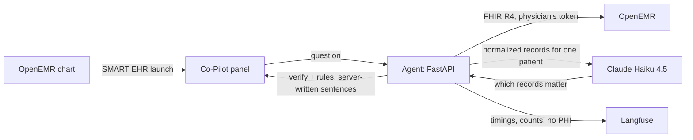

# Clinical Co-Pilot for OpenEMR (Gauntlet AgentForge)

A SMART on FHIR app that gives a primary care physician a **verified, cited briefing on the patient in front of them**, opened from inside the OpenEMR chart, in the ~90 seconds between rooms. Claude selects what matters; the server writes every sentence from the patient's own records and checks it against deterministic clinical rules before the physician sees it.

> This repository is a fork of OpenEMR ([Gauntlet-HQ/openemr-base-clean](https://github.com/Gauntlet-HQ/openemr-base-clean)). The Co-Pilot lives in [`agent/`](agent/) and [`deploy/`](deploy/); everything below the OpenEMR heading is upstream's README. **Demo and synthetic data only.**

| | |
|---|---|
| **OpenEMR (deployed)** | https://openemr-production-8676.up.railway.app |
| **Co-Pilot agent (deployed)** | https://agent-production-e0ed.up.railway.app ([`/health`](https://agent-production-e0ed.up.railway.app/health), [`/ready`](https://agent-production-e0ed.up.railway.app/ready)) |
| **Demo users** | Physician, clinician and front-office accounts with synthetic patients. Credentials are provided with the submission, not stored in this repository. |

### Documents

| Document | What's in it |
|---|---|
| [USERS.md](USERS.md) ([USER.md](USER.md)) | The target user (PCP with a 20-patient day), her workflow, six use cases and why an agent is the right shape for each |
| [AUDIT.md](AUDIT.md) | Security, performance, architecture, data quality and compliance audit: 71 verified findings plus what we found operating the deployment |
| [ARCHITECTURE.md](ARCHITECTURE.md) | The design, its trust boundaries, verification strategy, failure modes, API contract and tradeoffs |
| [KEY_METRICS.md](KEY_METRICS.md) | The six Week 1 numbers that show the product works, and why — plus six more for Week 2 |
| [W2_ARCHITECTURE.md](W2_ARCHITECTURE.md) | **Week 2**: document ingestion, the worker graph, hybrid retrieval, the write policy, the eval gate, risks and trade-offs |
| [W2_COST_AND_LATENCY.md](W2_COST_AND_LATENCY.md) | **Week 2**: dev spend, cost per document, projected production cost, and where the time goes |
| [ALERTS.md](ALERTS.md) | Three alerts and their on-call responses |
| [LOAD_TEST.md](LOAD_TEST.md) | Load tests at 10 and 50 concurrent physicians: p50/p95/p99, error rate, CPU and memory baselines, and where the next ceiling is |
| [AI_COST_ANALYSIS.md](AI_COST_ANALYSIS.md) | Measured development spend, cost per question, and monthly projections at 100 / 1K / 10K / 100K users with the architecture changes each tier needs |
| [TESTING.md](TESTING.md) | What is tested at which tier, and which test machinery is this project's versus OpenEMR's |
| [evals/](evals/) | 32 live eval cases (boundary, safety, adversarial, conversation, schedule) and their [latest results](evals/results/) |
| [api-collection/](api-collection/) | Bruno collection for the agent API: OAuth2 + PKCE, sessions, questions, schedule scan, with assertions |

### Where the code lives

The Co-Pilot is a fork's worth of OpenEMR plus **two directories of its own**. Nothing upstream was deleted or
rewritten to make room for it, which is deliberate: the assignment is integrating an agent into working healthcare
infrastructure, and a fork you have quietly gutted is one whose behaviour you can no longer vouch for.

```
agent/          the agent, as a standalone Python distribution (`pip install ./agent`)
  copilot/      the package: main, smart, sessions, fhir, normalize, rules, llm, verify, render, audit,
                observability, deadline, schemas, config, alerts — one module per boundary crossed
  tests/        tier 1, offline: real FHIR fixtures, fake Claude, no network
  pyproject.toml / Dockerfile
deploy/         how it runs: local stack, DB schema, demo seeding, and openemr/custom/ - the three files
                that skin OpenEMR and add the launch button, baked into the deploy image
evals/          tier 2, live: 32 cases against real Claude and real OpenEMR, plus the alert fault injector
loadtest/       tier 3: the Locust scenario (10 and 50 concurrent physicians)
api-collection/ Bruno collection for the agent API, with assertions
*.md            the submission documents, listed above
```

Three choices are worth naming, because they are the ones a reviewer will ask about:

- **The agent is a package, not scripts.** Everything importable is in `agent/copilot/`, and `agent/pyproject.toml`
  declares it as a distribution with pinned dependencies and a console script. `pip install ./agent` gives a working
  agent with no reference to the PHP around it. The agent never imports from the fork — it talks to OpenEMR over
  FHIR like any other SMART app — so it can be lifted out of this repository unchanged.
- **The modules are flat inside the package.** Fifteen modules, one per boundary the agent crosses (HTTP, OAuth,
  FHIR, the model, the database, the trace backend) or per decision it has to defend (normalization, rules,
  verification, rendering). A subpackage tree would add lookup cost without removing any coupling; the table in
  [agent/README.md](agent/README.md) says what each module owns and why it is not folded into its neighbour.
- **Nothing shipped by OpenEMR is edited.** The skin and the launch button ride on OpenEMR's own
  `custom/assets/custom.yaml` hook — the files live at `deploy/openemr/custom/assets/` and are copied into the
  image — and the one PHP constant that had to change is patched in that image, not in the source tree. Drop the
  overlay and the stock EHR is back.

### Architecture at a glance



1. The physician launches the Co-Pilot from the patient card; OpenEMR's OAuth confirms who she is and which patient is open. The agent binds the session to that patient **on the server**.
2. The agent prefetches allergies, medications, problems, recent labs, vitals and encounters in parallel, and **normalizes** OpenEMR's data defects (duplicate medications, placeholder lab values, mislabeled units).
3. For each question, Claude returns a plan: which cited records matter, trends to show, drugs being asked about, or a clarifying question. **It writes no clinical text.**
4. The server verifies every record id belongs to this patient, runs the clinical rules (allergy ↔ drug class, bleeding risk, critical labs, metformin with low eGFR…), renders each sentence from the record with its date, and says plainly what is missing or unavailable.

### Run it locally

Requirements: Docker (Docker Desktop, or `brew install colima docker docker-compose` then `colima start --cpu 4 --memory 6`), and Java 17 only if you want to generate new synthetic patients.

```bash
cd deploy/local
./make-certs.sh                                   # local CA + MySQL server cert (verified TLS, like production)
docker-compose -f compose.yml up -d mysql openemr # OpenEMR at http://localhost:8300 (admin / pass, local only)
```

Synthetic patients (Synthea, fixed seed so everyone gets the same patients):

```bash
java -Xmx4g -jar synthea-with-dependencies.jar -s 20260917 -cs 20260917 \
  --exporter.fhir.export false --exporter.ccda.export true --generate.only_alive_patients true -p 25
./import-synthea.sh /path/to/synthea/output/ccda  # OpenEMR's own CCDA importer
```

Demo users, today's schedule and edge-case patients (copy each script into the container, then run as the web user):

```bash
docker cp seed_demo.php agentforge-local-openemr-1:/tmp/ && docker exec agentforge-local-openemr-1 su-exec apache php /tmp/seed_demo.php
docker cp seed_edge_cases.php agentforge-local-openemr-1:/tmp/ && docker exec agentforge-local-openemr-1 su-exec apache php /tmp/seed_edge_cases.php
```

`seed_demo.php` prints the demo users' generated passwords once; store them outside the repository.

**The demo schedule is dated to the day you seed it.** `seed_demo.php` books today's ten appointments, so the schedule scan (UC5) and the calendar are empty on any later day until you re-run it. It is idempotent — re-running only adds what today is missing — so refresh the demo before a walkthrough:

```bash
docker exec agentforge-local-openemr-1 su-exec apache php /tmp/seed_demo.php   # local
sh ../remote_seed.sh seed_demo.php                                            # deployed (needs `railway link`)
```

OpenEMR settings the Co-Pilot needs (Admin → Config, or SQL over TLS): **Enable OpenEMR Standard FHIR REST API** (`rest_fhir_api=1`), **Site Address Override** = `http://localhost:8300` (`site_addr_oath`), **API Log Option = Minimal** (`api_log_option=1`). Then register the SMART app at `POST /oauth2/default/registration` (confidential client, launch URI `http://localhost:8000/smart/launch`, redirect URI `http://localhost:8000/smart/callback`) and enable it under Admin → System → API Clients.

The audit table the agent writes to, and its INSERT-only user, come from [deploy/sql/copilot_audit.sql](deploy/sql/copilot_audit.sql). Apply it to the same MySQL:

```bash
docker exec -i agentforge-local-mysql-1 sh -c 'mysql -uroot -p"$MYSQL_ROOT_PASSWORD"' < ../sql/copilot_audit.sql
```

Now start the agent. **Copy [`agent/.env.example`](agent/.env.example) to `agent/.env` first** — it lists every variable the agent reads, with the local stack's values and a note on which are optional. Fill in `SMART_CLIENT_ID` / `SMART_CLIENT_SECRET` from the registration above, `ANTHROPIC_API_KEY`, the Langfuse keys, `AUDIT_DB_PASSWORD`, and `EVAL_PATIENT_IDS` if you want the API-session path:

```bash
docker-compose -f compose.yml up -d agent          # Co-Pilot at http://localhost:8000
curl -s localhost:8000/ready                       # {"ready":true,...} once OpenEMR, Anthropic and Langfuse answer
```

Then open a patient in OpenEMR and click **Clinical Co-Pilot** beside their name.

### Tests

```bash
cd agent
docker build -f Dockerfile.dev -t agentforge-agent-dev .
docker run --rm -v "$PWD":/app agentforge-agent-dev python -m pytest -q
```

…or on the host, without Docker:

```bash
cd agent && pip install -r requirements.txt -r requirements-dev.txt && python -m pytest
```

Offline tests run against **real OpenEMR FHIR output** for synthetic patients ([`agent/tests/fixtures`](agent/tests/fixtures)); every test names the failure mode it guards against. [TESTING.md](TESTING.md) covers all four tiers — and which test machinery here is this project's versus OpenEMR's.

Live evals (real Claude, local stack, synthetic patients; about $0.08 per full run). These need two files from your own local setup that are not in this repository — see [evals/README.md](evals/README.md#running) for what they are and where to put them:

```bash
python evals/run_evals.py            # all 32 cases, writes evals/results/<timestamp>.json
python evals/fault_injection.py A2   # fires one ALERTS.md alert on purpose, then evaluates it
```

### Week 2 — what the Co-Pilot can now do

**Week 1 behaviour is unchanged.** Launch from the OpenEMR chart, ask about the patient, get an answer whose
every sentence is rendered by the server from a cited record. Nothing below replaces that; it is additive.

**Week 2 adds reading documents.** The information that matters before a follow-up visit is often not in the
structured record — it is in a scanned lab PDF or an intake form the front desk uploaded. So:

| | Week 1 | Week 2 |
|---|---|---|
| Sources | Structured OpenEMR records (FHIR) | …plus uploaded lab PDFs and intake forms, plus a guideline corpus |
| Citations | `ResourceType/id` of a held record | …plus a **box on the page** the value was read from, or an explicit "could not be located" |
| Writes | None. Read-only | Source documents stored; derived facts reach the chart **only on clinician approval** |
| Orchestration | One planning call, server-run tools | A supervisor and two workers, with every handoff logged and returned in the API response |
| Evals | 32 live cases, run on demand | A gate that blocks the build, runs offline, and is proven able to go red |

Attach a document from the panel: it is stored in the chart first (a faithful copy is not a claim), read by a
vision model constrained to a strict schema, and every value it reports is then located on the page *by the
server* — the model is never asked for a coordinate. Facts land in a review queue with their boxes, and only an
approval writes to the record.

The design, and the reasoning behind each of those choices, is in
[W2_ARCHITECTURE.md](W2_ARCHITECTURE.md).

### Week 2 — the eval gate

**Run the gate with one command.** No network, no API key, no OpenEMR container:

```bash
cd agent && pip install -r requirements.txt -r requirements-dev.txt && cd ..
python evals/w2/run_gate.py
```

It scores every case in [`evals/w2/cases/`](evals/w2/cases/) against boolean rubrics, compares each category to the
committed baseline in `evals/w2/baseline.json`, and **exits non-zero** if any category drops below its floor or
regresses more than five points. Failure output names the category, the baseline, the new rate and which cases
flipped.

Two commands prove the gate is real rather than decorative:

```bash
python evals/w2/run_gate.py --selftest   # passes ONLY if the known-bad case fails
python evals/w2/test_replay.py           # the keying rule: an edited prompt must be a hard failure
```

`--selftest` runs one deliberately-broken case from [`evals/w2/selftest/`](evals/w2/selftest/) whose only job is to
go red, and inverts the verdict. If it ever reports that case *passing*, the gate cannot detect anything and every
green build above it is meaningless. It is excluded from the scored set so it cannot redden the main build.

**How it stays deterministic.** Cases replay recorded model responses at the `app.state.llm` seam that
[`agent/tests/`](agent/tests/) already uses — see [`evals/w2/replay.py`](evals/w2/replay.py). At n=10 a 90% pass
rate carries ±19 points, so a 5% regression threshold measured against live model runs would be measuring noise.
Recordings are keyed on a hash of the **model-facing surface** (model id, system prompt, tool definitions, output
schema), and a cache miss is a hard case failure — never a live call, never a silent pass. So editing a prompt
turns the build red on its own, which is the regression the Week 2 grading specifically introduces.

Everything downstream of the model — parsing, schema validation, verification, rendering, the rules engine, the
scorer — still executes live in CI and is covered natively.

**Blocking.** [`.gitlab-ci.yml`](.gitlab-ci.yml) runs all three commands on the GitLab remote. To block locally
before a push as well:

```bash
git config core.hooksPath .githooks
```

Week 1 baseline behaviour (structured-record briefings, the 32 live eval cases above) is unchanged; Week 2 adds
document ingestion and this gate on top of it.

Alerts: `agent/copilot/alerts.py` evaluates the three [ALERTS.md](ALERTS.md) alerts from Langfuse (`python -m copilot.alerts`, or `python -m copilot.alerts <from> <to>` to replay a window).

OpenEMR itself carries the same look: [`deploy/openemr/`](deploy/openemr/) builds the deployed EHR image from a digest-pinned 8.5.0 base plus one stylesheet loaded through OpenEMR's supported `custom/assets/custom.yaml` hook, on top of OpenEMR's own dark theme (`css_header = style_dark.css`). No shipped theme file is edited; deleting the overlay restores the stock theme. Both the EHR and the panel are fixed dark, independent of the clinician's OS setting.

Dashboard: `deploy/langfuse_dashboard.py` creates the Langfuse dashboard (requests, errors, p50/p95 latency, tool calls, retries, verification outcomes, cost, tokens) through Langfuse's API; re-running it only adds what's missing.

---

[](https://github.com/openemr/openemr/actions/workflows/syntax.yml)
[](https://github.com/openemr/openemr/actions/workflows/styling.yml)
[](https://github.com/openemr/openemr/actions/workflows/test.yml)
[](https://github.com/openemr/openemr/actions/workflows/js-test.yml)
[](https://github.com/openemr/openemr/actions/workflows/phpstan.yml)
[](https://github.com/openemr/openemr/actions/workflows/rector.yml)
[](https://github.com/openemr/openemr/actions/workflows/shellcheck.yml)
[](https://github.com/openemr/openemr/actions/workflows/docker-compose-lint.yml)
[](https://github.com/openemr/openemr/actions/workflows/docker-lint-hadolint.yml)
[](https://github.com/openemr/openemr/actions/workflows/isolated-tests.yml)
[](https://github.com/openemr/openemr/actions/workflows/inferno-test.yml)
[](https://github.com/openemr/openemr/actions/workflows/composer.yml)
[](https://github.com/openemr/openemr/actions/workflows/composer-require-checker.yml)
[](https://github.com/openemr/openemr/actions/workflows/api-docs.yml)
[](https://codecov.io/gh/openemr/openemr)

[](#backers) [](#sponsors)

# OpenEMR

[OpenEMR](https://open-emr.org) is a Free and Open Source electronic health records and medical practice management application. It features fully integrated electronic health records, practice management, scheduling, electronic billing, internationalization, free support, a vibrant community, and a whole lot more. It runs on Windows, Linux, Mac OS X, and many other platforms.

### Contributing

OpenEMR is a leader in healthcare open source software and comprises a large and diverse community of software developers, medical providers and educators with a very healthy mix of both volunteers and professionals. [Join us and learn how to start contributing today!](https://open-emr.org/wiki/index.php/FAQ#How_do_I_begin_to_volunteer_for_the_OpenEMR_project.3F)

> Already comfortable with git? Check out [CONTRIBUTING.md](CONTRIBUTING.md) for quick setup instructions and requirements for contributing to OpenEMR by resolving a bug or adding an awesome feature 😊.

### Support

Community and Professional support can be found [here](https://open-emr.org/wiki/index.php/OpenEMR_Support_Guide).

Extensive documentation and forums can be found on the [OpenEMR website](https://open-emr.org) that can help you to become more familiar about the project 📖.

### Reporting Issues and Bugs

Report these on the [Issue Tracker](https://github.com/openemr/openemr/issues). If you are unsure if it is an issue/bug, then always feel free to use the [Forum](https://community.open-emr.org/) and [Chat](https://www.open-emr.org/chat/) to discuss about the issue 🪲.

### Reporting Security Vulnerabilities

Check out [SECURITY.md](.github/SECURITY.md)

### API

Check out [API_README.md](API_README.md)

### Docker

Check out [DOCKER_README.md](DOCKER_README.md)

### FHIR

Check out [FHIR_README.md](FHIR_README.md)

### For Developers

If using OpenEMR directly from the code repository, then the following commands will build OpenEMR (Node.js version 24.* is required) :

```shell
composer install --no-dev
npm install
npm run build
composer dump-autoload -o
```

### Contributors

This project exists thanks to all the people who have contributed. [[Contribute]](CONTRIBUTING.md).
<a href="https://github.com/openemr/openemr/graphs/contributors"></a>


### Sponsors

Thanks to our [ONC Certification Major Sponsors](https://www.open-emr.org/wiki/index.php/OpenEMR_Certification_Stage_III_Meaningful_Use#Major_sponsors)!


### License

[GNU GPL](LICENSE)
